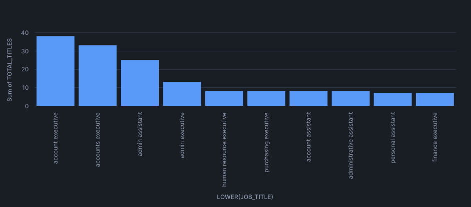
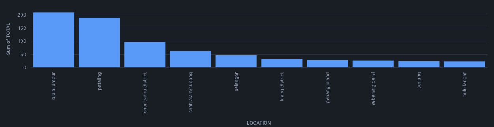

# Astronomer: Hands-On Lab

Overview
========

A project to build, run, and observe data products using Astronomer 

Project Contents
================

.
├── .env # Local environment variables
├── dags # Where your dags go
│   ├── `exampledag.py` # Example dag that showcases a simple ETL data pipeline
│   └── `01_serial_dag.py`: Create a DAG with at least 4 tasks that are serially dependent.
│   └── `02_parallel_dag.py`: Create a parallel DAG with at least 4 tasks where each task is run independently.
│   └── `03_crazy_dag.py`: Create your own crazy DAG that results in the most complex looking “Graph View” representation of the DAG as possible.
│   └── `04_external_connection_dag.py`: Connecting to External Systems
├── include # For any other files you'd like to include
├── plugins # For any custom or community Airflow plugins
│   └── example-plugin.py
├── tests # For any dag unit test files to be run with pytest
│   └── test_dag_example.py # Example test that checks for basic errors in your dags
├── airflow_settings.yaml # For your Airflow connections, variables and pools (local only)
├── packages.txt # For OS-level packages
└── requirements.txt # For Python packages
└── sql # sql files needed for `04_external_connection_dag.py`
└── images # graphs from our analysis -> Latinas In Tech - Jobs - Malaysia


Deploy This Project Locally
===========================

1. Clone this project on your local machine
```bash
git clone https://github.com/danyfdz92/astro-cli-demo.git
cd astro-cli-demo
```

2. Run the command we discussed earlier. This will build your Docker image and start the containers:
```bash
astro dev start
```

3. Access the UI through this URL: http://localhost:8080. Start the DAGs using the UI

Deploy This Project to Astronomer
=================================

If you have an Astronomer account, pushing code to a Deployment on Astronomer is simple. For deploying instructions, refer to Astronomer documentation: https://www.astronomer.io/docs/astro/deploy-code/

Latinas In Tech - JobStreet Job Postings - Malaysia
====================================================

LatinasInTech (https://latinasintech.org) is a non-profit organization dedicated to building the confidence, connections, and career momentum professionals need to succeed in today's fast-moving tech world. One of LIT is to provide the resources, opportunities and community needed to thrive, innovate and lead in tech. While LIT roots are in uplifting Latinas working in tech, LIT impact extends across industries, communities, and companies looking to build a more future-ready workforce.

We plan to analyze the JobStreet Job Postings Dataset from Hugging Face, which compiles tens of thousands of job listings across industries in Malaysia, including job titles, company names, locations, role categories, job types, salaries, and detailed descriptions. By mining this dataset for trends in high-demand skills, common job categories, and employer requirements, my goal is to identify the most sought-after roles in Malaysia’s job market. This analysis will help Latinas in Tech’s programming and guidance initiatives by highlighting emerging and in-demand opportunities so that Latinas in Malaysia can tailor their upskilling, certification, and career preparation efforts to align with real-world employer needs. Using this data-driven approach, we aim to empower Latinas with actionable insights that support competitive positioning in the Malaysian workforce.

Based on our analysis of Malaysian job market data, Account Executive roles emerge as the most in-demand position across industries in Malaysia. This high demand reflects the country’s strong need for professionals in sales, client management, business development, and financial account handling.



Kuala Lumpur is the city with the highest concentration of job opportunities in Malaysia, making it the country’s leading hub for employment across multiple industries.



The chart illustrates the breakdown of employment types across job postings, revealing that full-time positions dominate the market, while contract roles represent a significantly smaller share. This suggests that employers in Malaysia primarily seek long-term hires rather than short-term or project-based staff.


Sources
=======

Dataset: https://huggingface.co/datasets/azrai99/job-dataset
LatinasInTech: https://latinasintech.org/about
Astronomer: 
-  https://www.astronomer.io/docs/astro/first-dag-cli
- https://www.astronomer.io/docs/astro/deploy-github-integration
